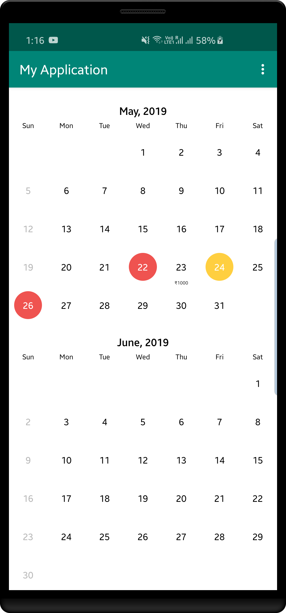
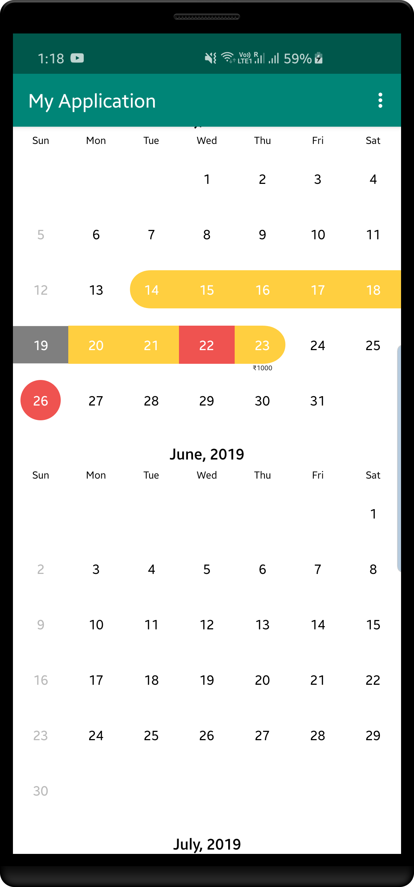

Date Range Picker 
===================
Date Range Picker is a Calendar Picker View to show a Customized Date Range Picker with improved UI and functionality to add subtitles to the dates

[  ](https://bintray.com/savvisingh/maven/date-range-picker/1.3/link)

Screenshots
-----------
 

Usage
-----
* 1. Add Calendar Picker View to XML

```xml
<com.savvi.rangedatepicker.CalendarPickerView
        xmlns:android="http://schemas.android.com/apk/res/android"
        xmlns:app="http://schemas.android.com/apk/res-auto"
        android:id="@+id/calendar_view"
        android:layout_width="match_parent"
        android:layout_height="match_parent"
        android:scrollbarStyle="outsideOverlay"
        android:clipToPadding="false"
        app:tsquare_orientation_horizontal="false"
        app:tsquare_dividerColor="@color/transparent"
        app:tsquare_headerTextColor="@color/custom_header_text"
        /> 
 ```
 
* 2. Initialize it in Java Class
      
```kotlin

        calendar.init(lastYear.getTime(), nextYear.getTime()) //
                .inMode(CalendarPickerView.SelectionMode.RANGE)
                .withSelectedDate(new Date())
// deactivates given dates, non selectable
                .withDeactivateDates(list)
// highlight dates in red color, mean they are aleady used.
                .withHighlightedDates(arrayList)
// add subtitles to the dates pass a arrayList of SubTitle objects with date and text
                .withSubtitles(getSubtitle())
                
 
```
 * There are other Selection modes also SINGLE and MULTIPLE
 * Adding Deactivated Dates
  User wont able to select these dates they will be deactivated.
  for eg, if you dont want to provide services on Saturday and Sunday you can mark them deactivated in that case the date text color wil be grey..
  
 * You can aslo specify custom month header style by passing SimpleDateFormat object in constructor
   For eg. if we want to display year

```java

calendar.init(lastYear.getTime(), nextYear.getTime(), new SimpleDateFormat("MMMM, YYYY", Locale.getDefault()));

 ``` 
 
 * Getting Selected Dates
You can get selected dates with the below function call when your user click finish or next button (which will you implement).

```java

calendar.getSelectedDates()

 ``` 
 
 * Specifying Horizontal Orientation
You can change the orientation of the CalendarPickerView by declaring it in xml view

```xml

app:tsquare_orientation_horizontal="true"

 ``` 
 
  * Changing the colors of different states
  
  Add this attr in your colors.xml file to override the default colors
       
    <color name="calendar_selected_day_bg">#E91E63</color>    
    <color name="calendar_selected_range_bg">#8BC34A</color>
    
    //this is for HighLighted dates
    <color name="calendar_unavailable_bg">#F44336</color>
    <color name="calendar_range_middle_unavailable_bg">#F44336</color>
    
    // this is for Deactivated dates
    <color name="calendar_range_middle_deactivated_bg">#673AB7</color>

   For Changing the text colors please have a look at day_text_color.xml in rangepicker module and you can ovveride the resource colors to customize it


 Import DateRangePicker dependency
------------------------------------

declare it into your pom.xml

```xml
<dependency>
  <groupId>com.savvi.datepicker</groupId>
  <artifactId>rangepicker</artifactId>
  <version>1.3.0</version>
  <type>pom</type>
</dependency>
```
or into your build.gradle

```groovy
dependencies {
    compile 'com.savvi.datepicker:rangepicker:1.3.0'
}
```

 License
---------

    Copyright 2017 Sarabjeet Singh

    Licensed under the Apache License, Version 2.0 (the "License");
    you may not use this file except in compliance with the License.
    You may obtain a copy of the License at

       http://www.apache.org/licenses/LICENSE-2.0

    Unless required by applicable law or agreed to in writing, software
    distributed under the License is distributed on an "AS IS" BASIS,
    WITHOUT WARRANTIES OR CONDITIONS OF ANY KIND, either express or implied.
    See the License for the specific language governing permissions and
    limitations under the License.
